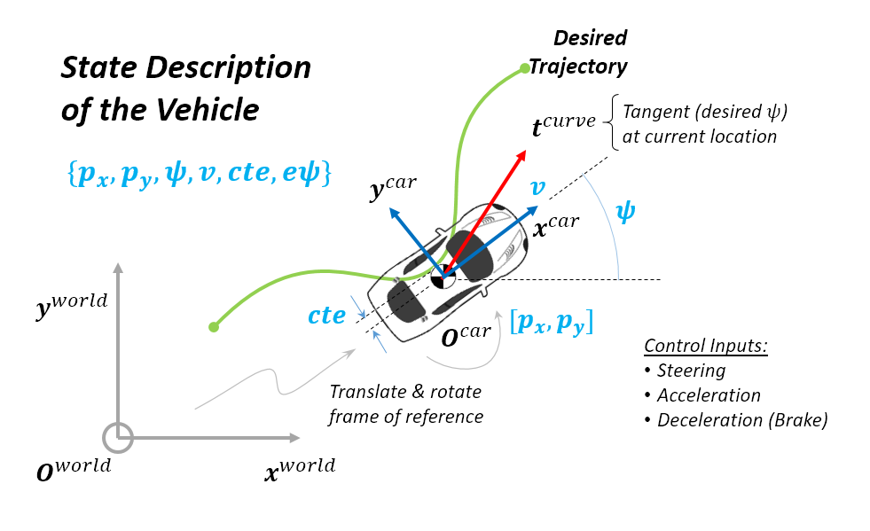

# 1. Term 2 MPC Controls Project Overview

This writeup is divided into the following sections.

  - [1. Configuration, Build and Run Process](#1-configuration-build-and-run-process)
  - [2. Source Code Implementation](#2-source-code-implementation)
      - [2.1. Implementation of MPC Class (FG_eval and Solver)](#21-implementation-of-mpc-class-fg_eval-and-solver)
      - [2.2. Hyperparameters Tuning](#22-hyperparameters-tuning)
      - [2.3. Telemetry Data, Optimization & Visualization](#23-telemetry-data-optimization--visualization)
  - [3. Results and Discussions](#3-results-and-discussions)

---

## 1. Configuration, Build and Run Process

* For this project, Windows 10 x64 WSL (Ubuntu 16.04) build environment was used. The core dependencies (cmake >=3.5, make >= 4.1, gcc/g++ >= 5.4) are already a part of this system.
* [uWebSockets](https://github.com/uWebSockets/uWebSockets) was installed using `install-ubuntu.sh`.
* Fortran Compiler was installed using `sudo apt-get install gfortran`.
* [Ipopt](https://projects.coin-or.org/Ipopt) version of Ipopt 3.12.1 was installed using `install_ipopt.sh` by passing argument as extracted directory for Ipopt (`Ipopt-3.12.1`).
* [CppAD](https://www.coin-or.org/CppAD/) was installed using `sudo apt-get install cppad`.
* [Eigen](http://eigen.tuxfamily.org/index.php?title=Main_Page). This is already part of the repo so you shouldn't have to worry about it.
* The term 2 simulator was downloaded from the [release](https://github.com/udacity/self-driving-car-sim/releases) section of the repository.
* The build for MPC project was done  using command `mkdir build && cd build && cmake .. && make`. The exectuable was run using `./mpc`. The executable (server) waits for uWebSockets connection from Term 2 Simulation (client). Once connection is established, the executable recieves "telemetry" data from the client and sends back "steer" command data.

## 2. Source Code Implementation

The source code implementation is done in three major parts. A summary of this is provided in the following. Subsequently, a walk through of each section is described.

1. The first part of the implementation is in the file `MPC.cpp`, which defines the `FG_eval` and the `MPC` class implementation. In this file, the cost objective, constraints and the Ipopt optimization solver details are implemented.
2. The second import aspect of implementation is the tunable tunable hyperparameters, for example, those used for defining the objecdtive functions. These are implemented in the file `params.cpp`.
3. The final aspect of implementation is the telemetry data management, optimization/prediction and visualization in the file `main.cpp`.

### 2.1. Implementation of MPC Class (FG_eval and Solver)
The details have already been documeted [elsewhere](https://github.com/svanimisetti/CarND-MPC-Quizzes) and will be dicussed in this file in detail.

### 2.2. Hyperparameters Tuning

The following code block lists the section of the code for hyperparameter definition. The number of future timesteps for prediction is set to `N=10`. Further, the time intervals for future prediction is 200ms. To account for controller latency and predict control inputs, 100ms time delay is used.

The critial cost penalty imposed to minimize sudden changes in steering (`lambda_ddelta`) is set to 5000. All other cost penalty parameters are held at 1. The reference speed to the vehicle can also be tune here to assess controller stability.

``` c++
  // Set the timestep length and duration
  const size_t N = 10;
  const double dt = 0.2;
  const double dt_latency = 0.1;

  // Cost penalties for cte, epsi and v_start
  const double lambda_cte = 1.0;
  const double lambda_epsi = 1.0;
  const double lambda_v = 1.0;    

  // Additional hyperparameters to penalize agressive maneuvers
  // Following lambda's are Lagrange multipliers for the optimizer
  // Cost penalties to minimize use of steering and acceleration
  const double lambda_delta = 1.0;
  const double lambda_a = 1.0;
  // Cost penalties to minimize sudden changes in steering and acceleration
  const double lambda_ddelta = 5000.0;
  const double lambda_da = 1.0;

  // Length from front to CoG that has a similar radius.
  const double Lf = 2.67;

  // Reference (target steady state) velocity
  const double ref_cte = 0.0;
  const double ref_epsi = 0.0;
  const double ref_v = 60.0 * 0.44704; // convert mph to m/s
```

### 2.3. Telemetry Data, Optimization & Visualization

The telemetry data from client is recieved by the server and processed in lines 91-99. In addition to telemetry data already defined in the starter code, additionally, steering angle values is also extracted (see lines 98 & 99) based on information from [DATA.md](https://github.com/svanimisetti/CarND-MPC-Project/blob/master/DATA.md).

All data processing, optimization and predictions are done in the vehicle coordinate frame. Since the telemetry data is in the world or global coordinate frame, reference trajectory point data is transformed to vehicle coordinate frames in lines 103-107. Note that both translations and rotation (by `phi`) are accounted. In line 11, a 3rd degree polynomial is fitted to these points. A summary of the state variables and the trasnformation from global to vehicle coordinate frame is shown in the following figure.



To account for latency, a future state at `t+100ms` is predicted from lines 114-127. Note that these equations are same as those introduced in the class, but certain assumptions mean that few terms in the equations are 0.0.

The optimized state information is returned by the MPC controller optimization solver (see line 129) in the variable `vars`. The immediate predicted control inputs (steering & throttle), with latency of 100ms, are sent back to client in lines 138-139. Also, the precited trajectory and the reference trajectory line are passed back to the client  for visualization in lines 142-162.

## 3. Results and Discussions

The implementation of the MPC controller was used to successfully complete multiple laps of the lake track. Multiple reference vehicle speed between 30 MPH and 60 MPH with an increment of 5 MPH were investigated. The controller is stable upto speeds of 55 MPH. There are signs of degradation at 60 MPH. A screen grab of the MPC controller completing a lap of the lake track can be seen [here](./trial_60mph.mp4).

At speeds above 60 MPH, the controller becomes unstable at sharp turns. This is attributed to latency and processing delays in the controller. This can perhaps be improve further by putting a constraint on the throttle depending on the curvature of the 3rd degree polynomial use to fit reference trajectory. The optimizer will seek lower throttle (and hence speed) before sharp turns. This will be implemented in future endeavours.
